These images come from a 4chan thread (probably when Chanarchive was still around) where some user wrote a literal interpretation of the classic Dr. Seuss book, *Green Eggs and Ham*.

Unfortunately, the original thread was not archived, but judging from the standard UNIX timestamp found on all 4chan images, it was first posted to 4chan on `1325980346`, or `Sat, 07 Jan 2012 23:52:26 GMT`.

## The Book

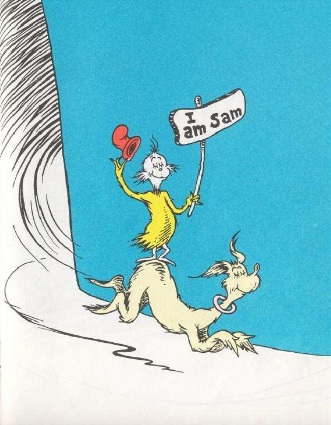  
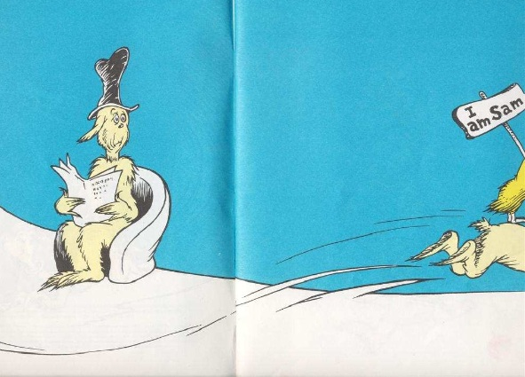  
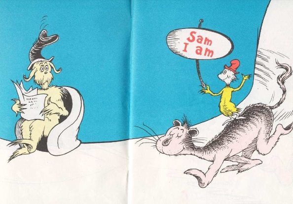  
  
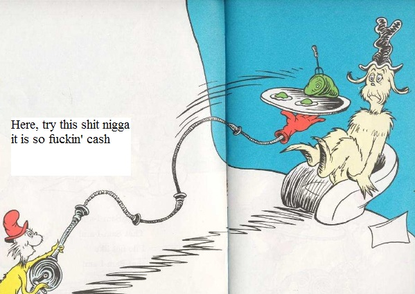  
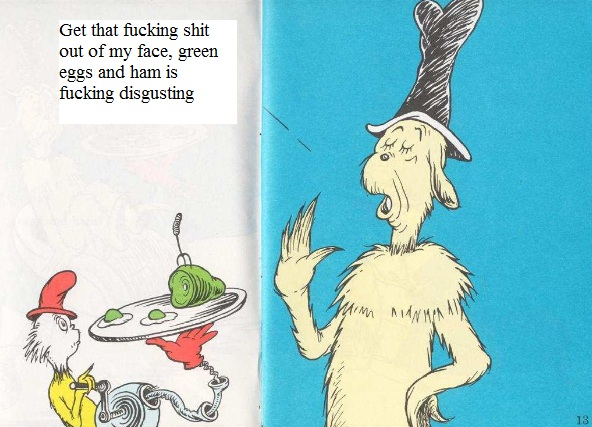  
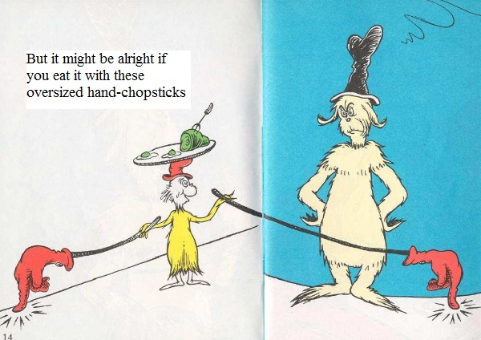  
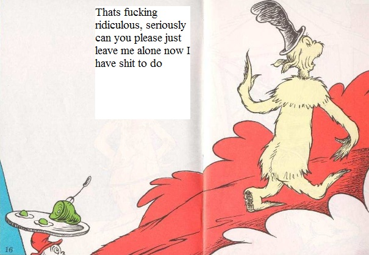  
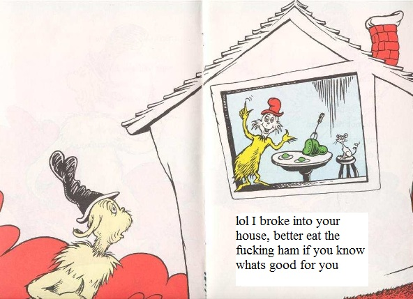  
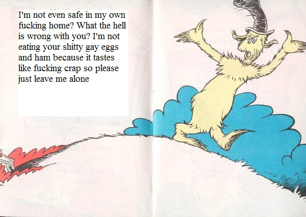  
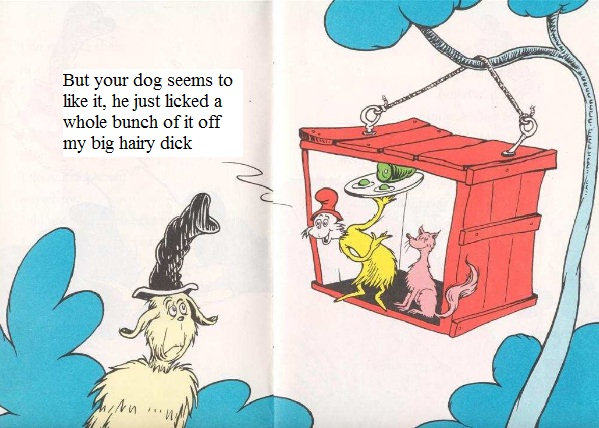  
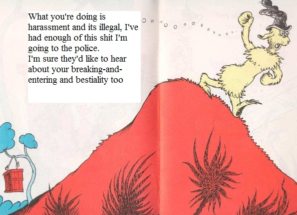  
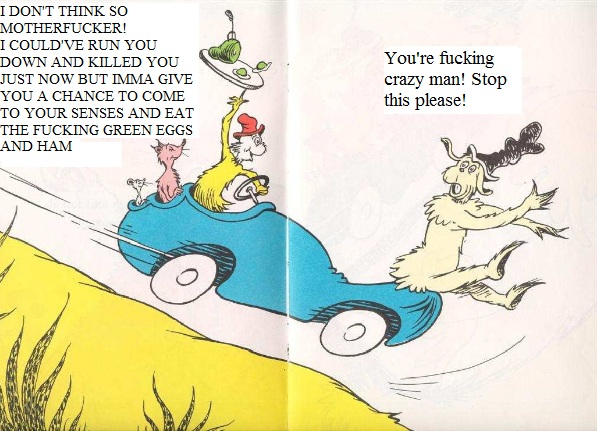  
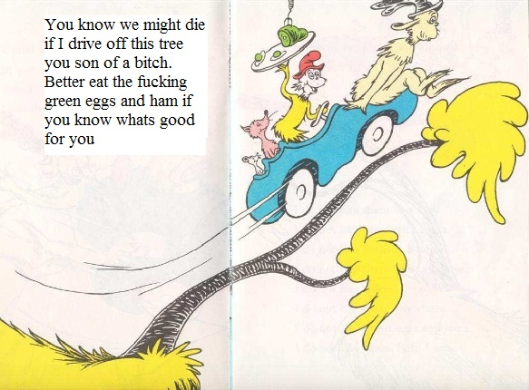  
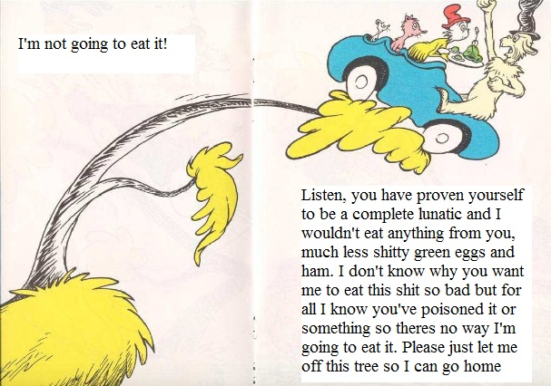  
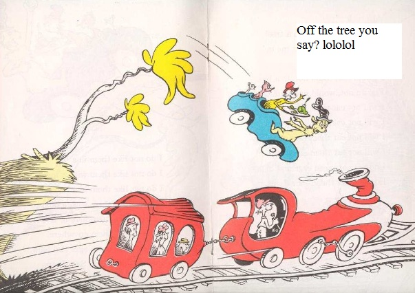  
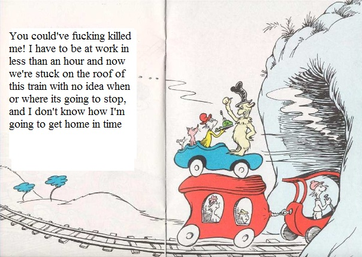  
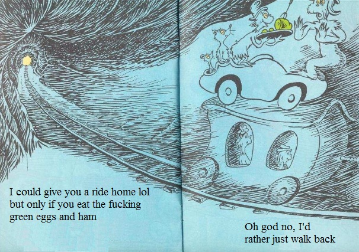  
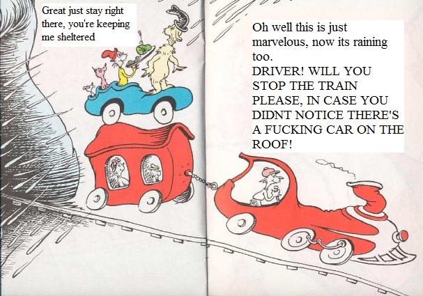  
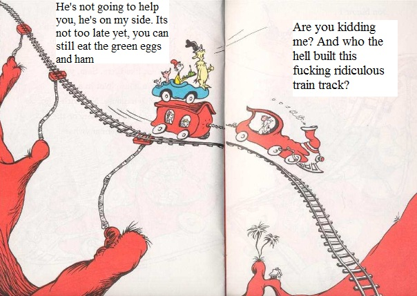  
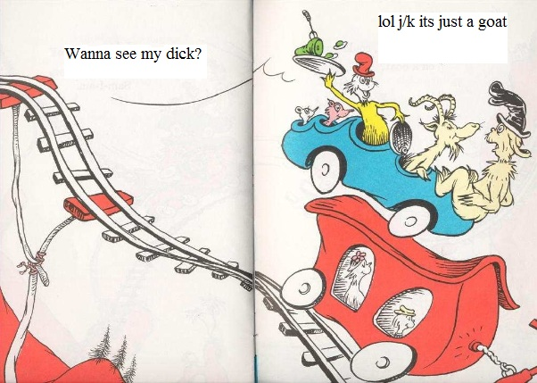  
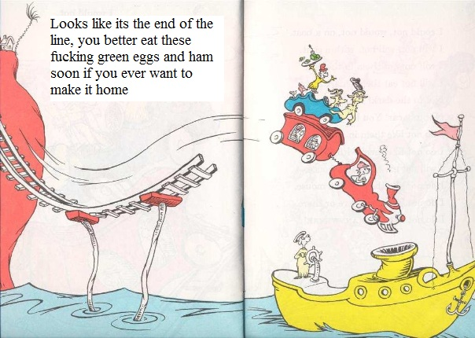  
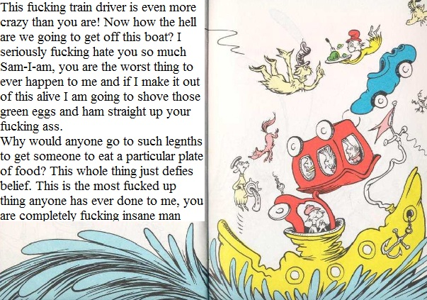  
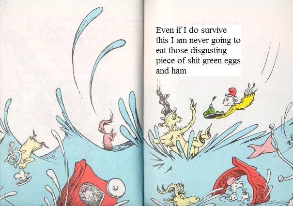  
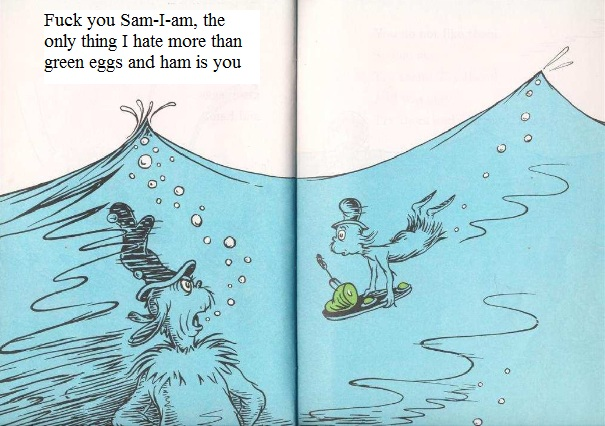  
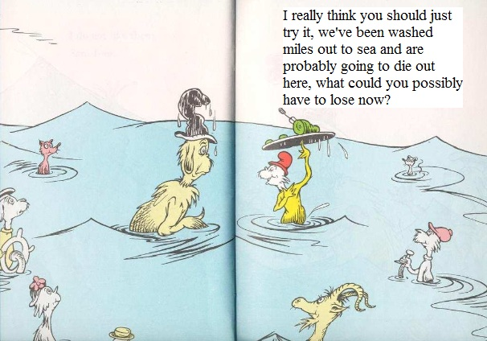  
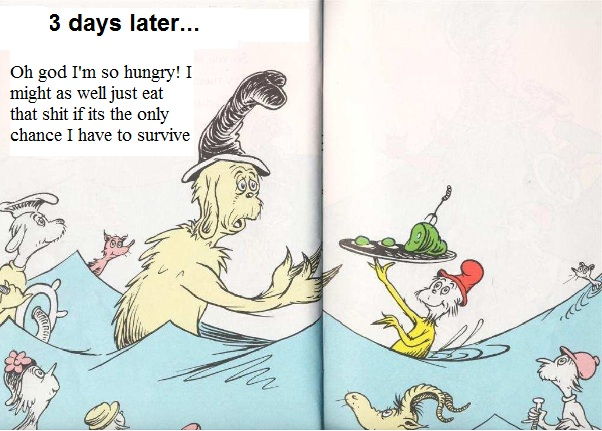  
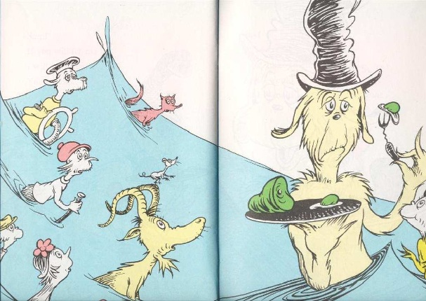  
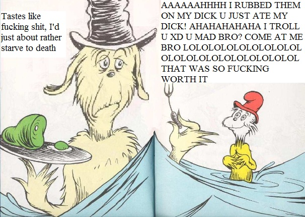  